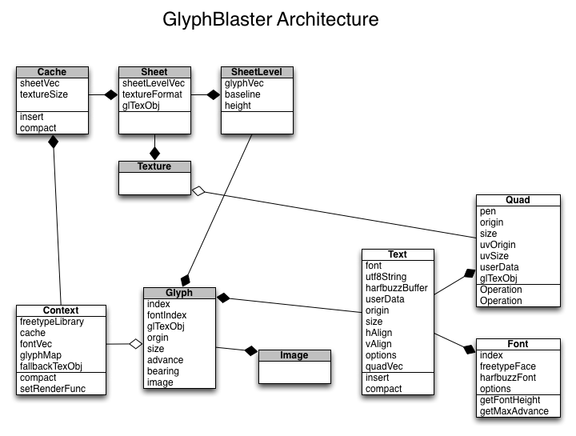

# Glyph Blaster

## WIP C++11 Port

Justifications.

* Standard smart pointers that will make the memory management of resources less error prone.
* can drop dependency on uthash and utlist, and use standard collections
* lamdas provide a better mechanism for rendering hooks then c function ptrs.
* all of my personal projects are in C++, C linkage is not important to me.
* shared lib version of library is also not important to me.
* Interop with other languages is not important to me.

### Design questions

### Proposed Architecture Diagram

## Features

* Pluggable render function, to integrate into existing engines.
* Uses HarfBuzz for glyph shaping for ligatures & arabic languages.
* FreeType is used for rasterization, after shaping.
* Manages glyph bitmaps in a tightly packed set of OpenGL textures.
* utf8 support
* rtl language support (arabic & hebrew)

## Dependencies

* icu4c
* FreeType2
* HarfBuzz-0.9.0

## Implementation Notes

* When cache is full, glyphs will use a fallback texture, which is 1/2 alpha.
* When glyph is not present in the font, the replacement character is used. �
* Bidi makes word-wrapping a pain.  do this after word wrapping/justification is functional for rtl & ltr text.
* I still don't know how slow a full repack is. Benchmark it.
* I'm not sure if the interface is very good.
  * Text's are not mutable, they must be destroyed and re-created.
  * No metrics available.
  * The metrics should be good enough to perform custom word-wrapping, bidi, underline & html styles
    at a higher level.

## TODO:

### Dependency Build Tasks

* compile option to make dependency on HarfBuzz & icu4c optional
* Bundle harf-buzz, to make building easier
* Minimize/control use of icu4c, might have to implement some stuff for harf-buzz as well.

### Implementation Tasks

* Split MakeGlyphQuadRuns into two parts.
  * Build metrics/do word wrapping.
  * Build quads from metrics.
* Add get metrics function to text.
* Add ability to set pen position.
* assertion and more graceful failure when static buffers overflow.
* Test support of LCD subpixel decimated RGB using shader and GL_COLOR_MASK
* Enable sRGB aware blending, during rendering. (if available) provide a sample renderer
* Justify-Vertical: top, center, bottom
* Justify: Scale to fit
* currently two fonts with different pt sizes will have two copies of the same FreeType font.
  resources should be shared.
* add glyph bitmap-padding option, necessary for scaled or non-screen aligned text.
* Currently mipmapping on glyph texture is disabled.
* bidi
* Better SDL test prog.
* Add pluggable texture creation & subload functions, for Direct3D renderers.

